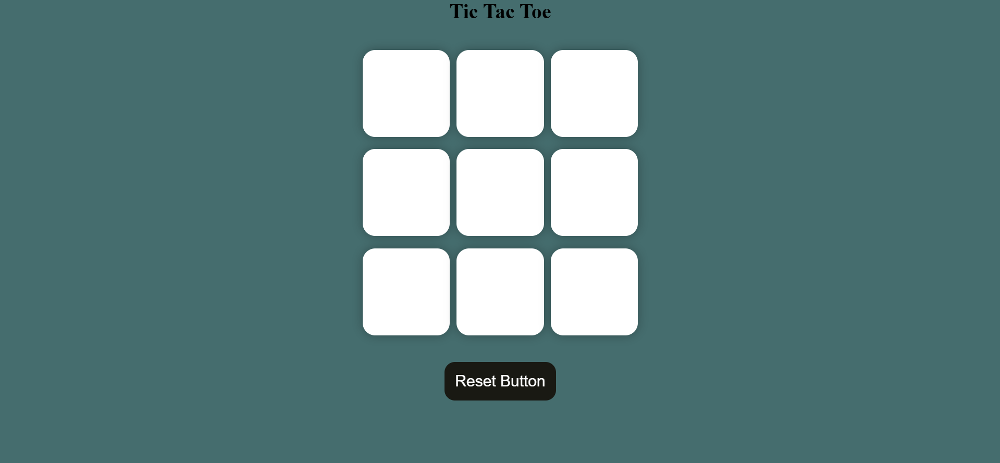
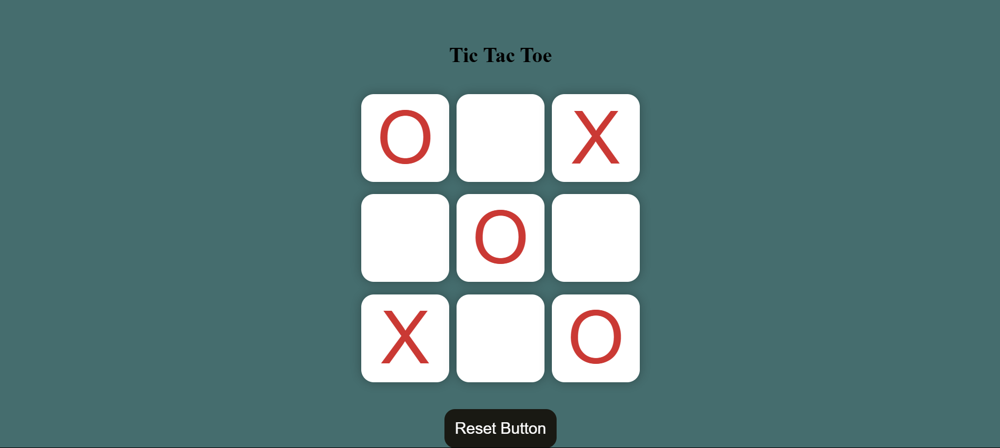
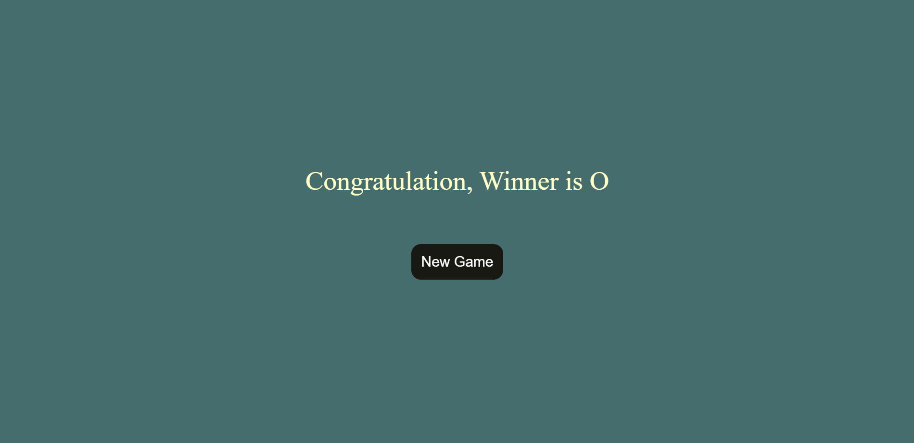

# 🎮 Tic-Tac-Toe

**Tic-Tac-Toe** is a classic two-player game built using **pure HTML, CSS, and JavaScript** — no frameworks, no libraries! It includes features such as a **reset button** to clear the current game and a **new game button** to reinitialize the board for a fresh start.

---

## 🕹️ Features

- 🎯 Classic **3x3 Tic-Tac-Toe** gameplay
- 👤 Two-player mode (X vs O)
- 🔄 **Reset Game** button to clear the current game board
- 🆕 **New Game** button to reinitialize the entire game
- 📱 Fully responsive and mobile-friendly layout
- 🎨 Clean and intuitive UI with CSS styling

---

## 📁 Project Structure

tic-tac-toe/
- index.html # Main HTML structure
- style.css # Styling using pure CSS
- script.js # Game logic using JavaScript

---

## 🚀 How to Run

1. Clone or download this repository.
2. Open the `index.html` file in your web browser.
3. Start playing!

---

## 📸 Preview

---

## 🧠 Game Logic Highlights

- Alternates turns between "X" and "O"
- Checks for winning combinations after each move
- Displays the winner or a draw result
- Resets or restarts the game based on user interaction

---

## 💡 Future Improvements (Optional Ideas)

- Add AI for single-player mode
- Score tracking system
- Theme switcher (light/dark)
- Make it responsive

---